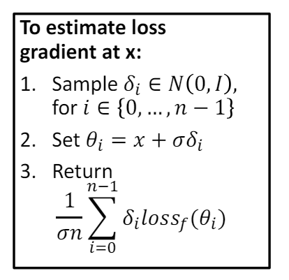

TODO: my torch and torchvision python libs are not the same as in the requirements.txt. make sure to try to run it also on the requirements.txt's versions

# Q1

1.
output:
```
TODO
```

explanation:
 First, I implemented the ```compute_accuracy``` code as asked by calculating the successful adversary examples fracture over all the adversary examples, and the printed accuracy was:
```The test accuracy of the model is: 0.8750```

2. \[ X_{i+1} = \text{Project}(X_i + a \nabla_x \text{sign}(loss_f(X, Cx))) \]
I implemented the PGD white box attack as described in class:

for targeted case we will consider loss as ```loss = -self.loss_func(outputs, y)```, so maximizing the 'loss' later will minimize the ```self.loss_func(outputs, y)``` so that we will get closer to the desired target class.

for untargeted case we will consider loss as ```loss = self.loss_func(outputs, y)```, so minimizing the 'loss' later will maximize the ```self.loss_func(outputs, y)``` so that we will get further from the original true class.

to optimise the running time, i ran the attack on the whole batch of images and not on each image seperately by taking gradient of the sum of the losses (over the whole batch). We need to take the sum (and not the average) because the the images in 16-image ```adv_samples``` batch are independent of each other (in context of the gradient calculation).

```
White-box attack:
        - untargeted success rate: 0.9850
        - targeted success rate: 0.9450
```

3. We will use the NES method to estimate gradients in a black-box setting. This involves $2*k$ perturbations ($k$ samples that each will be taken on both positive and negative pertubation around the original image). In the referenced paper it is called Antithetic sampling which is described as more efficient and accurate gradient estimation. with the changes in the output we can estimate the direction of the gradient.
In addition, we will use the 


As described in the lecture, for each input we will estimate the gradients using R s.t
we will take \[
  R \sim \mathcal{N}(\mu,\,\sigma^{2})\,.
\] 



Compute the gradient of the loss function 
J(𝑥) with respect to the input x
\[
\nabla_x J(x) = \frac{\partial J(x)}{\partial x}
\]
Update the momentum term:
\[
m = \mu \cdot m + \frac{\nabla_x J(x)}{\|\nabla_x J(x)\|_1}
\]

where \(\mu\) is the momentum parameter, and \(\|\nabla_x J(x)\|_1\) is the L1 norm of the gradient.

Then we add the momentum-scaled gradient to the perturbation:
\[
\eta = \eta + \alpha \cdot \text{sign}(m)
\]
where \(\alpha\) is the step size.


# Q2
In this question I implemented a transfer attack using the deravative of the mean of all models.
There were many techniches both in class and in the referenced paper on how to combine the gradients of the models. I chose a version of the mean of the gradients of the models which is similar to the idea in the paper.


# Q3

output:
```
Model accuracy before flipping: 0.8250
Total # weights flipped: 2250
Max RAD: 0.7152
RAD>15%: 0.0213
```

1. The maximum RAD is 0.7152.
2. The fraction of bits lead to RAD>15% is 0.0213.
3. 
   We can see in this image that the most significant bytes are those that lead to the biggest RAD. this is because the most significant bits are the most significant bits in the float representation of the weights, so changing them will lead to the biggest change in the actual float value of the weights. specifically the 31-st bit-flip leads to the biggest RAD, way bigger than the rest of the bits.
   in float representation, the 31-st bit is the most significant bit of the exponent, so changing it will lead to the biggest change in the actual float value of the weights which really makes sense. TODO: check that i really calculated the median of the RADs correctly.

looks like only changing the 31-st bit leads to RAD>15%. that is because of changing this bit in the respresentation of float leads to infinity value and this model is not robust enough to deal with such big change in the actual float value


# TODO:
- remove all prints from the code
- fix all 'TODO's in the code
- in 1.3 i need to understand if i need to estimate the gradient for each input alone or all together, because in 1.2 i used the avg loss of all the inputs and took the gradient from this avg.
- check if i implemented the momentum right
- check if ```adv_samples += self.alpha * grad.sign()``` is the right expression to update the adv_examples with the grad.
